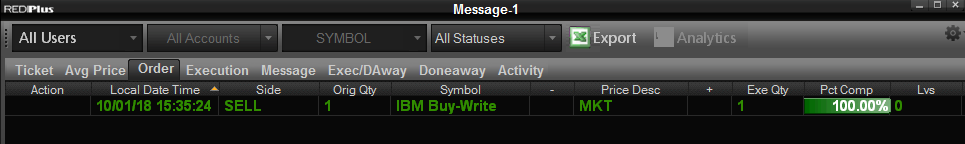
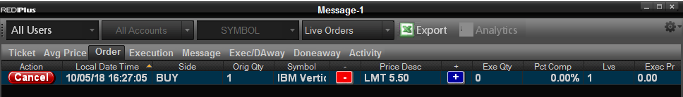
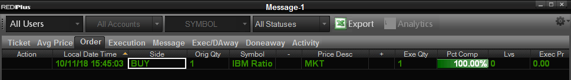
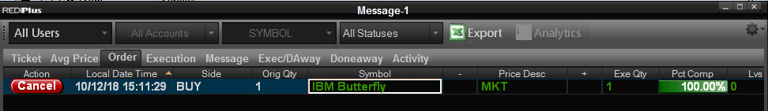

# REDIPlus API Complex Options Trading Example #
## Introduction ##
With REDIPlus’s powerful options capabilities, users can easily trade single and complex spread strategies globally through multiple brokers. The options trade can be sent via REDIPlus UI or REDIPlus API. The example in this article demonstrates how to trade complex option via REDIPlus API with C# and Visual Studio 2017. REDIPlus and the tutorial example run on the same machine, side by side. The example supports the following strategies for complex options orders.
* Buy-Write
* Vertical
* Ratio
* Butterfly

The valid parameters of the example are:

```
  --strategy          Required. The strategy for the spread option (Buy-Write, Vertical, Ratio, or
                      Butterfly)

  -s, --symbol        Required. The symbol of an option

  -q, --quantity      (Default: 1) Options contract size

  -l, --limitprice    Limit Price of an order (Required by "Limit")

  -a, --account       The account used for this order

  -e, --exchange      (Default: DEM2 DMA) Broker (or Exchange) Destination

  -f, --tif           (Default: Day) Time In Force for an order

  -p, --pricetype     (Default: Limit) Order type of a complex order (Limit, or Market)

  --type1             (Default: Call) Options Type of the first leg (Call or Put) for the
                      Buy-Write, Vertical, Ratio, and Butterfly strategies

  --type2             (Default: Call) Options Type of the second leg (Call or Put) for
                      the Ratio

  --side1             (Default: Buy) Side of the first leg (Buy or Sell) for the
                      Buy-Write, Vertical, Ratio, and Butterfly strategies

  --side2             (Default: Sell) Side of the second leg (Buy or Sell) for the
                      Buy-Write, Vertical, Ratio, and Butterfly strategies

  --side3             (Default: Buy) Side of the third leg (Buy or Sell) for the
                      Butterfly strategy

  --position1         (Default: Open) Options order position of the first leg (Open or
                      Close) for the Buy-Write, Vertical, Ratio, and Butterfly strategies

  --position2         (Default: Open) Options order position of the second leg (Open or
                      Close) for the Buy-Write, Vertical, Ratio, and Butterfly strategies

  --position3         (Default: Open) Options order position of the third leg (Open or
                      Close) for the Butterfly strategy

  --date1             Options expiration date in REDI date format of the first leg (e.g.
                      "Oct 05 '18") for the Buy-Write, Vertical, Ratio, and Butterfly
                      strategies

  --date2             Options expiration date in REDI date format of the second leg (e.g.
                      "Oct 05 '18") for the Ratio strategy

  --strike1           The strike price of the first leg for the Buy-Write, Vertical,
                      Ratio, and Butterfly strategies

  --strike2           The strike price of the second leg for the Vertical, Ratio, and
                      Butterfly strategies

  --strike3           The strike price of the third leg for the Butterfly strategy

  --ratio1            (Default: 1) The ratio of the first leg for the Ratio strategy

  --ratio2            (Default: 1) The ratio of the second leg for the Ratio strategy

  --help              Display this help screen.

  --version           Display version information.
``` 
By default, the order will be sent to a broker simulator server. If the account (-a, --account) is not specified, the application will use the first available account returned from the OPTIONORDER.GetAccountAt method. 

The complete project code is available for download at [OptionsStrategyExample](https://github.com/TR-API-Samples/Example.REDI.CSharp.Examples/tree/master/OptionsStrategyExample).

For the detailed steps for sending a complex options order, please refer to the [Trading Complex Options in C#](https://developers.thomsonreuters.com/transactions/redi-api/learning?content=50084&type=learning_material_item) tutorial.

## Buy-Write ##
Buy-write is an options trading strategy in which the investor is buying shares and simultaneously selling call options against those shares to generate income from option premiums. It can limit the loss because the options position is covered by the underlying stocks.

With REDIPlus API, this strategy requires two legs. The first leg is for the option order and the second leg is for the underlying stocks.

```csharp
COMPLEXORDER objOrder = new COMPLEXORDER();

objOrder.Strategy = "Buy-Write";
objOrder.SetSymbol(0, "IBM");
objOrder.SetQuantity(0, "1");
objOrder.SetExchange(0, "DEM2 DMA");
objOrder.SetPriceType(0, "Market");
objOrder.SetTIF(0, "Day");
objOrder.SetAccount(0, "EQUITY-TR");


//Leg 1 of Buy-Write leg (First leg has to be option order)
objOrder.SetSide(1, "Sell");
objOrder.SetPosition(1, "Open");
objOrder.SetOptType(1, "Call");
objOrder.SetMonth(1, "Nov '18");
objOrder.SetStrike(1, "110");
objOrder.SetAccount(1, "EQUITY-TR");

//Leg 2 of Buy-Write leg (Equity Leg)
objOrder.SetSide(2, "Buy");          
objOrder.SetAccount(2, "EQUITY-TR");

object ord_err = null;
bool status;
status = objOrder.Submit(ref ord_err);
```
The above code buys the 100 shares of IBM and sells one Nov '18 110 Call with the market order price type. The order will be sent to a broker simulator server.

You can also use the following parameters with the example to send a buy-write complex option order.

```
ComplexOptionsTrade.exe --strategy buy-write -s IBM -p Market --type1 Call --side1 Sell --position1 Open --date1 "Nov '18" --strike1 "110" --side2 Buy
```
The output is:
```
Send a buy-write spread order with the following options:
Symbol: IBM
PriceType: Market
Quantity: 1
Exchange: DEM2 DMA
TIF: Day
Account: EQUITY-TR
==============================
Leg 1: Call Sell Open Nov '18 110
Leg 2: Buy Open
Order has been submitted properly
```
The order can be verified from the Message Monitor.



## Vertical ##
In options trading, a vertical spread is an options strategy constructed by simultaneously buying a certain number of options and selling an equal number of options of the same type, same underlying security, same expiration date, but at different strike prices. They can be created with either all calls or all puts. This strategy limits the risk involved in the options trade but at the same time, it also reduces the profit potential.

With REDIPlus API, this strategy requires two legs. The option type and expiration date can only be specified on the first leg. Then, REDIPlus API will use these values for the second leg.

```csharp
COMPLEXORDER objOrder = new COMPLEXORDER();

objOrder.Strategy = "Vertical";
objOrder.SetSymbol(0, "IBM");
objOrder.SetQuantity(0, "1");
objOrder.SetExchange(0, "DEM2 DMA");
objOrder.SetPriceType(0, "Limit");
objOrder.SetTIF(0, "Day");
objOrder.SetAccount(0, "EQUITY-TR");


//Leg 1
objOrder.SetSide(1, "Buy");
objOrder.SetPosition(1, "Open");
objOrder.SetOptType(1, "Call");
objOrder.SetMonth(1, "Nov '18");
objOrder.SetStrike(1, "120");
objOrder.SetAccount(1, "EQUITY-TR");

//Leg 2   
objOrder.SetSide(2, "Sell");
objOrder.SetPosition(2, "Open");
objOrder.SetStrike(2, "130");
objOrder.SetAccount(2, "EQUITY-TR");

//Set limit price
objOrder.SetPrice(0, "5.5");

object ord_err = null;
bool status;
status = objOrder.Submit(ref ord_err);
```
The above code buys IBM Nov '18 120 Call and sells IBM Nov '18 130 Call. The spread entry price is $5.5. The order will be sent to a broker simulator server.

You can also use the following parameters with the example to send a vertical complex option order.

```
ComplexOptionsTrade.exe --strategy vertical -s IBM -l 5.5 --type1 Call --side1 Buy --date1 "Nov '18" --strike1 "120" --side2 Sell --strike2 "130"
```
The output is:

```
Send a vertical spread order with the following options:
Symbol: IBM
PriceType: Limit
Limit Price: 5.5
Quantity: 1
Exchange: DEM2 DMA
TIF: Day
Account: EQUITY-TR
==============================
Leg 1: Call Buy Open Nov '18 120
Leg 2: Call Sell Open Nov '18 130
Order has been submitted properly
```
The order can be verified from the Message Monitor.


## Ratio ##
A ratio spread is a variation of the vertical spread. Typically, it involves buying and selling options on the same underlying security and the same expiration date but with different strike prices. However, a number of option contracts and a number of contracts sold are in ratio. The most common ratio is 2:1 with 2 options sold to 1 option bought. This strategy provides a limited profit and has a chance of incurring unlimited risks if the underlying stock is too volatile.

With REDIPlus API, this strategy requires two legs. The option type and expiration date between the first and second legs can be different. The ratio of each leg is set through the **COMPLEXORDER.SetQuantity** method.

```csharp
COMPLEXORDER objOrder = new COMPLEXORDER();

objOrder.Strategy = "Ratio Orders";
objOrder.SetSymbol(0, "IBM");
objOrder.SetQuantity(0, "1");
objOrder.SetExchange(0, "DEM2 DMA");
objOrder.SetPriceType(0, "Market");
objOrder.SetTIF(0, "Day");
objOrder.SetAccount(0, "EQUITY-TR");


//Leg 1
objOrder.SetSide(1, "Buy");
objOrder.SetPosition(1, "Open");
objOrder.SetOptType(1, "Call");
objOrder.SetMonth(1, "Nov '18");
objOrder.SetStrike(1, "120");
objOrder.SetQuatity(1, "1");
objOrder.SetAccount(1, "EQUITY-TR");

//Leg 2   
objOrder.SetSide(2, "Sell");
objOrder.SetPosition(2, "Open");
objOrder.SetOptType(2, "Call");
objOrder.SetMonth(2, "Dec '18");
objOrder.SetStrike(2, "130");
objOrder.SetQuatity(2, "2");
objOrder.SetAccount(2, "EQUITY-TR");

object ord_err = null;
bool status;
status = objOrder.Submit(ref ord_err);
```

The above code buys one IBM Nov '18 120 Call contract and sells two IBM Dec '18 130 Call contracts with the market order price type. The order will be sent to a broker simulator server.

You can also use the following parameters with the example to send a vertical complex option order.

```
ComplexOptionsTrade.exe --strategy ratio -s IBM -p Market --type1 Call --side1 Buy --date1 "Nov '18" --strike1 "120" --ratio1 1 --side2 Sell --date2 "Dec '18" --strike2 "130"  --ratio2 2
```

The output is:

```
Send a ratio spread order with the following options:
Symbol: IBM
PriceType: Market
Quantity: 1
Exchange: DEM2 DMA
TIF: Day
Account: EQUITY-TR
==============================
Leg 1: 1 Call Buy Open Nov '18 120
Leg 2: 2 Call Sell Open Dec '18 130
Order has been submitted properly
```
The order can be verified from the Message Monitor.



## Butterfly ##
The butterfly spread is a neutral strategy that is a combination of the vertical spread trades. It relates to four option contracts with the same expiration and option type but three different strike prices. For example, the trader sells two option contracts at the middle strike price, buys one option contract at a lower strike price, and buys another option contract at a higher strike price. It can be constructed using calls or puts. This strategy provides a limited profit and risk. It is used when the trader believes the price of the underlying stock will not deviate much from the current price.

With REDIPlus API, this strategy requires three legs. The option type and expiration date can only be specified on the first leg. Then, REDIPlus API will use these values for other legs. The first and third legs have the same side (Buy or Sell) and each relates to one option contract. The second leg has the opposite side (Buy or Sell) and it relates to two option contracts.

```csharp
COMPLEXORDER objOrder = new COMPLEXORDER();

objOrder.Strategy = "Butterfly";
objOrder.SetSymbol(0, "IBM");
objOrder.SetQuantity(0, "1");
objOrder.SetExchange(0, "DEM2 DMA");
objOrder.SetPriceType(0, "Market");
objOrder.SetTIF(0, "Day");
objOrder.SetAccount(0, "EQUITY-TR");


//Leg 1
objOrder.SetSide(1, "Buy");
objOrder.SetPosition(1, "Open");
objOrder.SetOptType(1, "Call");
objOrder.SetMonth(1, "Dec '18");
objOrder.SetStrike(1, "110");
objOrder.SetAccount(1, "EQUITY-TR");

//Leg 2   
objOrder.SetSide(2, "Sell");
objOrder.SetPosition(2, "Open");
objOrder.SetOptType(2, "Call");
objOrder.SetMonth(2, "Dec '18");
objOrder.SetStrike(2, "120");
objOrder.SetAccount(2, "EQUITY-TR");

//Leg 3
objOrder.SetSide(3, "Buy");
objOrder.SetPosition(3, "Open");
objOrder.SetOptType(3, "Call");
objOrder.SetMonth(3, "Dec '18");
objOrder.SetStrike(3, "130");
objOrder.SetAccount(3, "EQUITY-TR");

object ord_err = null;
bool status;
status = objOrder.Submit(ref ord_err);
```

The above code uses the butterfly strategy to buy and sell the following IBM option contracts with the market order price type.
* Buy one IBM Dec '18 110 Call contract 
* Sell two IBM Dec '18 120 Call contract
* Buy one IBM Dec '18 130 Call contract

The order will be sent to a broker simulator server.

You can also use the following parameters with the example to send a butterfly complex option order.

```
ComplexOptionsTrade.exe --strategy butterfly -s IBM -p Market --type1 Call --side1 Buy --date1 "Dec '18" --strike1 "110" --side2 Sell --strike2 "120" --side3 Buy --strike3 "130"
```

The output is:

```
Send a butterfly spread order with the following options:
Symbol: IBM
PriceType: Market
Quantity: 1
Exchange: DEM2 DMA
TIF: Day
Account: EQUITY-TR
==============================
Leg 1: 1 Call Buy Open Dec '18 110
Leg 2: 2 Call Sell Open Dec '18 120
Leg 3: 1 Call Buy Open Dec '18 130
Order has been submitted properly
```
The order can be verified from the Message Monitor.



## Summary ##
The complex options trade can be sent via REDIPlus UI or REDIPlus API. With REDIPlus API, **RediLib.COMPLEXORDER** class is used to populate and submit an order. This article demonstrates the ways to use REDIPlus API to send complex options orders with the Buy-Write, Vertical, Ratio, and Butterfly strategies. 

## References ##
* [Buy-write](https://en.wikipedia.org/wiki/Buy-write)
* [Vertical](http://www.theoptionsguide.com/vertical-spread.aspx)
* [Ratio](http://www.option-trading-guide.com/ratio-spreads.html)
* [Butterfly](https://www.investopedia.com/terms/b/butterflyspread.asp)
* [REDI API SPECIFICATION](https://developers.thomsonreuters.com/transactions/redi-api/docs?content=25822&type=documentation_item)
* [Trading Complex Options in C#](https://github.com/TR-API-Samples/Example.REDI.CSharp.Examples/tree/master/REDIComplexOptions)
* [OptionsStrategyExample](https://github.com/TR-API-Samples/Example.REDI.CSharp.Examples/tree/master/OptionsStrategyExample)
