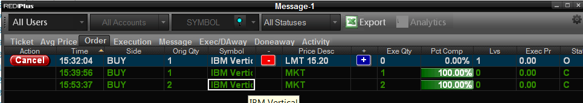

# Trading Complex Options in C#
## Introduction
With REDIPlus’s powerful options capabilities, users can easily trade single and complex spread strategies globally through multiple brokers. The options trade can be sent via REDIPlus UI or REDIPlus API. This tutorial demonstrates how to trade complex option via REDIPlus API with C# and Visual Studio 2017. REDIPlus and the tutorial example run on the same machine, side by side. REDIPlus supports several strategies for complex options orders.

Please note that this example doesn't demonstrate how to retrieve real-time price from REDIPlus API. Rather, this tutorial is focused on sending complex options orders.

## Prerequisites

* REDIPlus is installed
* REDIPlus valid credentials are used to login
* User has access to the REDI broker simulator route (for testing purposes)
* Visual Studio 2017
* REDIPlus API

Note: To install REDIPlus and REDIPlus API, please refer to [REDIPlus & API Installation Guide](https://developers.thomsonreuters.com/transactions/redi-api/quick-start).

## Implementation
**1. Create a project:**

We start by creating a new Visual Studio project:

File->New->Project-> Visual C# -> Console App (.NET Framework)

**2. Add the Redi 1.0 Type library**

REDIPlus API is a COM library. To use it, we need to create a reference to this library. In the solution explorer, right click on **References** and select **Add Reference...** . 

On the left menu, select **COM** and then check on **Redi 1.0 Type Library**. 


Click on **OK** button to add REDIPlus API to the project.

If **Redi 1.0 Type Library** doesn't appear on the list, click **Browser...** button to locate the **Redi.tlb** file. Typically, this file should be found in **%LOCALAPPDATA%\REDI Tech\Primary** folder.

After adding the **Redi 1.0 Type Library**, expand the **References** in the solution explorer. The **RediLib** will be appeared in the list.


Then, add the **using** directive to the code to allow the use of types in the RediLib namespace.

```csharp
using RediLib;
```
**3. Get expiration dates**

The expiration date is a required field for trading options. **RediLib.OPTIONORDER** can be used to get the list of expiration dates for an option.

First, the application creates a new instance of **RediLib.OPTIONORDER** and sets an option in its **Symbol** property.

```csharp
OPTIONORDER objOrder = new OPTIONORDER();
objOrder.Symbol = "IBM";
```

Next, it calls **GetExpirationDatesCount** to get the count of option expiration dates based on the order object. The count is returned in the reference variable passed as an argument.
```csharp
object objExpirationCount = null;
objOrder.GetExpirationDatesCount(ref objExpirationCount);

```
Then, it calls **GetExpirationDateAt** for each index to get the options expiration date in REDI format from the expiration date list.
```csharp
for (int i = 0; i < (int)objExpirationCount; i++)
{
    object objExpiration = null;
    objExpiration = objOrder.GetExpirationDateAt(i);
    ...
}
```

**4. Get strike prices**

The strike price is a required field for trade options. **RediLib.OPTIONORDER** can be used to get the list of strike prices for an option.

First, the application creates a new instance of **RediLib.OPTIONORDER** and populates it with an option symbol, option type (Call or Put), and expiration date. For example:

```csharp
OPTIONORDER objOrder = new OPTIONORDER();
objOrder.Symbol = "IBM";
objOrder.type = "Call";
objOrder.Date = "Jul 27 '18";
```

Next, it calls **GetStrikesCount** to get the count of options strike prices based on the order object. The count is returned in the reference variable passed as an argument.
```csharp
object objStrikeCount = null;
objOrder.GetStrikesCount(ref objStrikeCount);
```
Then, it calls **GetStrikeAt** for each index to get the options strike price from the strike price list.
```csharp
for (int i = 0; i < (int)objStrikeCount; i++)
{
    object objStrike = null;
    objStrike = objOrder.GetStrikeAt(i);
    ...
}
```
**5. Create an instance of COMPLEXORDER**

**RediLib.COMPLEXORDER** is used to submit a complex option order. First, the application creates a new instance of **RediLib.COMPLEXORDER** and populates it with the strategy of complex option order. For example, the below code uses the **Vertical** strategy for the order.

```csharp
COMPLEXORDER objOrder = new COMPLEXORDER();   
objOrder.Strategy = "Vertical";

``` 
The valid values for the strategy are:
* Box
* Butterfly
* Buy-Write
* Calendar
* Delta Neutral
* Diagonal
* Married Put
* Ratio Orders
* Reverse Conversion
* Straddle
* Strangle
* Vertical

**6. Populate the order information at the 0th index**

Then, the application calls the following methods at the 0th index to set the order information.


|Method Name|Description|Example|
|-------------|-----------|-------|
|SetSymbol|This method assigns an underlying product of a complex order object|IBM|
|SetExchange|This method assigns a broker destination name of a complex order object. The application can use "DEM2 DMA" for a broker simulator. **OPTIONORDER.GetExchangeAt** can be used to retrieve the broker/exchange destination name from the exchange list|DEM2 DMA|
|SetPriceType|This method assigns an order type of a complex order object. Valid values are **Market** and **Limit**|Limit|
|SetTIF|This method assigns a TIF (Time In Force) of a complex order object. Valid values are:<ul><li>**Day**</li><li>**IOC** (Immediate-or-Cancel)</li><li>**FOK** (Fill-or-Kill)</li><li>**OPG** (For market-on-open (MOO) or limit-on-open (LOO) order)</li></ul> Most brokers support **Day** only|Day|
|SetQuantity|This method assigns order quantity of a complex order object|1|
|SetAccount|This method assigns an account name to a complex order object. **OPTIONORDER.GetAccountAt** can be used to get the account name from the account list|EQUITY-TR|

For example, the below code setups a complex option order for **IBM**. Time in force is **Day** and the order type is **Limit**. The order will be sent to a demo server.

```csharp
objOrder.SetSymbol(0, "IBM");
objOrder.SetQuantity(0, "1");
objOrder.SetExchange(0, "DEM2 DMA");
objOrder.SetPriceType(0, "Limit");
objOrder.SetTIF(0, "Day");
objOrder.SetAccount(0, "EQUITY-TR");

```

**7. Populate option strategy legs**

A complex option order contains multiple legs. The number of legs depends on the strategy type.  The application can call the **COMPLEXORDER.GetLogsCount** method to get number of legs requried by a complex option order. For example, the **Vertical** strategy requires two legs.

```csharp
string legsCount = objOrder.GetLegsCount();
```

Next, the application starts populating multiple legs at the 1st index. For example, the first leg and second leg of the **Vertical** strategy will be populated at the 1st and 2nd index respectively. For each leg, the following methods can be called to set the leg information. 


|Method Name|Description|Example|
|-------------|-----------|-------|
|SetSide|This method assigns a side to nth leg of a complex order object. Valid values are **Sell** and **Buy**|Buy|
|SetPosition|This method assigns an option position to nth leg of a complex order object. Valid values are **Open** and **Close**|Open|
|SetOptType|This method assigns an option type to nth leg of a complex order object. Valid values are **Put** and **Call**|Put|
|SetMonth|This method assigns an options expiration date in REDI date format to nth leg of a complex order object. **OPTIONORDER.GetExpirationDateAt** can be used to retrieve expiration dates, as shown in step 3|Oct 05 '18|
|SetStrike|This method assigns a strike price to nth leg of a complex order object. **OPTIONORDER.GetStrikeAt** can be used to retrieve strike prices, as shown in step 4|185.00|
|SetAccount|This method assigns an account name to nth leg of a complex order object. **OPTIONORDER.GetAccountAt** can be used to the account name from the account list|EQUITY-TR|


For example, the below code populates two legs of the **Vertical** strategy for a complex option order.


```csharp
//First Leg
objOrder.SetSide(1, "Buy");
objOrder.SetPosition(1, "Open");
objOrder.SetOptType(1, "Call");
objOrder.SetMonth(1, "Oct 05 '18");
objOrder.SetStrike(1, "125.00");
objOrder.SetAccount(1, "EQUITY-TR");          

//Second Leg
objOrder.SetSide(2, "Sell");
objOrder.SetPosition(2, "Open");
objOrder.SetOptType(2, "Call");
objOrder.SetMonth(2, "Oct 05 '18");
objOrder.SetStrike(2, "130.00");
objOrder.SetAccount(2, "EQUITY-TR");

```
**8. Set price and submit a complex order**

If the price type of a complex option order is **Limit**, the price must be set by call the **SetPrice** method at the 0th index before submitting an order. 

However if the price type is **Market**, the **Submit** method can be called without setting the price.

```csharp
//For Limit price type
objOrder.SetPrice(0, "20");

object ord_err = null;
bool status;
status = objOrder.Submit(ref ord_err);

if (!status)
{
    Console.WriteLine($"Error: {(string)ord_err}");
}
else
{
    Console.WriteLine("Order has been submitted properly");
}
```


The **Submit** returns **True** if order submission was successful. Otherwise it will return **False**. If it returns **False**, the failure reason will be populated in the reference variable passed as a string argument. 

## Example
The simple application called **VerticalSpreadOptionsTrade** is developed to demonstrate how to send a vertical complex option order. It supports the following parameters:

```
  -s, --symbol        Required. The symbol of an option

  -q, --quantity      (Default: 1) Options contract size

  -l, --limitprice    Limit Price of an order (Required by "Limit")

  -a, --account       The account used for this order

  -e, --exchange      (Default: DEM2 DMA) Broker (or Exchange) Destination

  -f, --tif           (Default: Day) Time In Force for an order

  -p, --pricetype     (Default: Limit) Order type of a complex order (Limit, or Market)

  --type1             (Default: Call) Options Type of the first leg (Call or Put)

  --type2             (Default: Call) Options Type of the second leg (Call or Put)

  --side1             (Default: Buy) Side of the first leg (Buy or Sell)

  --side2             (Default: Sell) Side of the second leg (Buy or Sell)

  --position1         (Default: Open) Options order position of the first leg (Open or
                      Close)

  --position2         (Default: Open) Options order position of the second leg (Open or
                      Close)

  --date1             Options expiration date in REDI date format of the first leg (e.g. "Oct 05 '18")

  --date2             Options expiration date in REDI date format of the second leg (e.g. "Oct 05 '18")

  --strike1           The strike price of the first leg

  --strike2           The strike price of the second leg

  --help              Display this help screen.

  --version           Display version information.
```

The application behaviors are:

* The symbol (-s, --symbol) is a required argument
* The Price (-l, --limitprice) is required when the value of price type (-p, --pricetype) is **Limit**
* If the expiration dates are not specified, the application will use the first available expiration date returned from the **OPTIONORDER.GetExpirationDateAt** method
* If the strike prices are not specfied, the application will use the first and second available strike price returned from the **OPTIONORDER.GetStrikeAt** method
* If the account (-a, --account) is not specified, the application will use the first available account returned from the **OPTIONORDER.GetAccountAt** method
* By default, it sends an order to the demo server which can be overridden via the (-e, --exchange) parameter
* The application can specify the information of the first leg via --type1, --side1, --position1, --date1, and --strike1 parameters
* The application can specify the information of the second leg via --type2, --side2, --position2, --date2, and --strike2 parameters


## Test and Run

**1. Send a vertical complex order for IBM at 15.20**
```
VerticalSpreadOptionsTrade.exe -s IBM -l 15.20
```
The command runs with symbol (-s) and limit price (-l) options. Therefore, it uses the expiration date, strike price, and account retrieved from the REDIPlus API. For other options, the default values are used.

```
Send a vertical spread order with the following options:
Symbol: IBM
PriceType: Limit
Quantity: 1
Exchange: DEM2 DMA
TIF: Day
Account: EQUITY-TR
Limit Price: 15.20
==============================
Leg 1: Call Buy Open Aug 31 '18 124.00
Leg 2: Call Sell Open Aug 31 '18 125.00
Order has been submitted properly
```
The order can be verified from the Message Monitor.


**2. Send a vertical complex order for IBM with Market price type**
```
VerticalSpreadOptionsTrade.exe -s IBM -p Market
```
The command runs with symbol (-s), and price type (-p) options. Therefore, it uses the expiration date, strike price, and account retrieved from the REDIPlus API. For other options, the default values are used.

```
Send a vertical spread order with the following options:
Symbol: IBM
PriceType: Market
Quantity: 1
Exchange: DEM2 DMA
TIF: Day
Account: EQUITY-TR
==============================
Leg 1: Call Buy Open Aug 31 '18 124.00
Leg 2: Call Sell Open Aug 31 '18 125.00
Order has been submitted properly
```
The order can be verified from the Message Monitor.


**3. Send a vertical complex order with expiration dates and strike prices**
```
VerticalSpreadOptionsTrade.exe -s IBM -p Market -q 2 --date1 "Dec '18" --strike1 145 --date2 "Jan '19" --strike2 150
```
The command runs with symbol (-s), price type (-p), quantity (-q), and expiration dates and strike prices for the first and second legs. Therefore, it uses the account retrieved from the REDIPlus API. For other options, the default values are used.

```
Send a vertical spread order with the following options:
Symbol: IBM
PriceType: Market
Quantity: 2
Exchange: DEM2 DMA
TIF: Day
Account: EQUITY-TR
==============================
Leg 1: Call Buy Open Dec '18 145
Leg 2: Call Sell Open Jan '19 150
Order has been submitted properly
```
The order can be verified from the Message Monitor.



## Summary

The complex options trade can be sent via REDIPlus UI or REDIPlus API. With REDIPlus API, **RediLib.COMPLEXORDER** class is used to populate and submit an order. To get the list of accounts, exchanges, expiration dates, strike prices, **RediLib.OPTIONORDER** can be used.

The usage is simple. The application creates a new instance of **RediLib.COMPLEXORDER** class, populates its values, and then call submit to send an order.

## References
* [REDI API SPECIFICATION](https://developers.thomsonreuters.com/transactions/redi-api/docs?content=25822&type=documentation_item)
