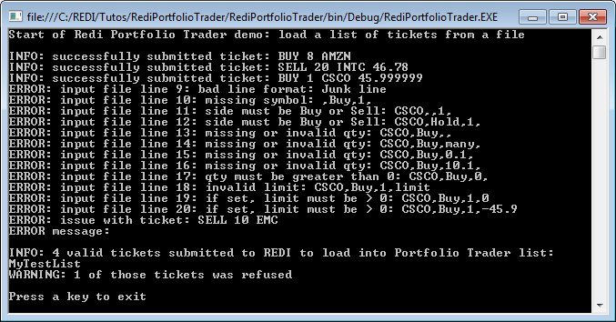

# REDIPlus Portfolio Trader List Load in C#

## Introduction
In this tutorial we demonstrate how to use the REDIPlus API (i.e. the Redilink library) to load a list of tickets into Portfolio Trader, using C# .Net code.

## Concepts

### Portfolio trader lists
Lists (aka baskets or batches of orders) contain tickets. A single list can contain up to 1000 tickets to trade different securities.

REDI gives you the ability to upload a list into REDI using various means:

* Via FIX, from a 3rd party OMS
* Importing a file manually through the GUI
* Automatically loading a file from a folder (this requires setting up auto-load in the GUI)
* Directly via the API

Once a list is loaded in REDI, it becomes visible in the Portfolio Trader window. From there you can send the orders (called _Waves_ in Portfolio Trader) to your broker(s).

This tutorial shows how to upload a list into REDI, using the API and C# .Net code.

### Tickets
Tickets represent parent orders in REDI.

A ticket can be defined using a _Symbol_ (like the ticker), _Side_ (buy or sell) and _Quantity_. As an example, a ticket could specify to buy 100 shares of company XYZ 

A ticket is not an order, it is a trading intention. The REDI user (the trader) must create an order off the ticket for a broker to receive the order and actually execute it. The trader can create multiple orders for a single ticket, but he cannot exceed the bounds of a ticket. As an example, for a ticket to buy 1000 XYZ, the trader could create an order to buy 600 from JPM and a second order to buy 400 from DB, but he cannot exceed the total of 1000 XYZ.

## Prerequisites
An installed copy of **Microsoft Visual Studio** is required to experiment with the code. We used VS 2013.

REDIPlus and the REDIPlus API must be installed. For installation instructions, please refer to the [REDIPlus & API Installation Guide](https://developers.thomsonreuters.com/transactions/redi-api/quick-start).

Valid REDI credentials and entitlements are required to log into REDIPlus, this is done via the GUI.

## Implementation
You can create the project manually, but note that the complete project code is also available for download.

### Create a project
We start by creating a new Visual Studio project:

File -> New -> Project -> Visual C# -> Console App (.NET Framework)

### Reference the Redi 1.0 Type Library
The REDIPlus API is a COM library. To use it, we need to create a reference to this library. In the solution explorer, right click on **References** and select **Add Reference...** .

In the left menu, choose **COM** and then select the **Redi 1.0 Type Library**:


Click on **OK** to add the REDIPlus API to the project.

If the **Redi 1.0 Type Library** does not appear in the list, click on **Browse** to locate the _Redi.tlb_ file. Typically, this file should be found in the _%LOCALAPPDATA%\REDI Tech\Primary_ folder.

After adding the **Redi 1.0 Type Library**, expand the **References** in the solution explorer. The **RediLib** should appear in the list:


After that we can add the **using** directive to the code to allow the use of types from the RediLib namespace:

```csharp
using RediLib;
```

### Understanding the code

#### Workflow
Our sample code starts with a few member declarations; they allow you to configure the program.

After some initial validations of inputs and outputs, the code checks if it can connect to REDIPlus. That implies it must be running, and you have logged in using valid REDI credentials.

It then reads a CSV file containing a list of tickets, and processes each one of them. It first validates the ticket content, and if valid submits the ticket to the REDI API, to load inside the REDI Portfolio Trader.

Feedback on most actions is delivered to the console, and to an output file.

#### Member declarations
You need to set valid values in all the variables before attempting to run the program. You require:
- A valid REDI user name – to which the tickets will be assigned
- A valid REDI account
- A list name – you can set anything you like; all the tickets will appear under that name inside the Portfolio Trader window
- A path and file name for the input CSV (a sample CSV is delivered with the code)
- A path and file name for the output log file

#### Check connection to REDIPlus
This is mandatory for the code to work. Note that authentication is done when launching REDIPlus manually; the code does not need to manage that.

To perform this check, any call to the API suffices. If it fails, there is an issue.

Here we simply attempt to assign a new ticket by making a call to the REDI library, and trap the exception:

```csharp
//-----------------------------------------------------------------
//Check connection to REDIPlus:
//-----------------------------------------------------------------
try { ORDER testPtOrder = new ORDER(); }
catch (System.Runtime.InteropServices.COMException comErr)
{
    DebugPrint("FATAL: cannot connect to REDIPlus. Check if it is running and you are logged in.", swLog);
    DebugPrint("ERROR message:\n" + comErr, swLog);
    swLog.Close();
    ConsolePrintAndWaitForEnter("Press Enter to exit");
    return;  //Exit main program
}
```

#### Read the input CSV file
The format of the CSV was arbitrarily defined as 1 ticket per line, each line containing the symbol, side, quantity and optional limit price. Empty lines and lines starting with a “#” (comment lines) are ignored. This is just a simple example; feel free to define a format that fits your use case.

Reading the file is standard C# coding, there is no need to describe that here.

We implemented some basic validation rules, applied to each line:
- Ignore empty lines and comment lines (those starting with a #)
- Check if the first item (the Symbol) exists
- Check if the second item (the Side) is “Buy” or “Sell”
- Check that the third item (the Quantity) is a valid number (integer, greater than 0)
- Check that if the fourth item is defined (the limit Price) it is a valid number (double)

Here is the validation code:

```csharp
//Ignore empty lines and comment lines (starting with #):
ignoreLine = String.IsNullOrEmpty(fileLine);
if (!ignoreLine)
    if (!String.IsNullOrEmpty(fileLine)) ignoreLine = fileLine.Substring(0,1) == "#";
if (!ignoreLine)
{
    //Parse the file line to extract the comma separated ticket parameters:
    string[] splitLine = fileLine.Split(new char[] { ',' });
    symbol = splitLine[0];
    side =   splitLine[1];
    qty =    splitLine[2];
    limit =  splitLine[3];
    //Validate ticket parameters. If valid, submit order:
    if (!String.IsNullOrEmpty(symbol))
    {
        if (side == "Buy" || side == "Sell")
        {
            if (!String.IsNullOrEmpty(qty) && int.TryParse(qty, out quantity))
            {
                if (quantity >= 1)
                {
                    limitPrice = 0;
                    if (String.IsNullOrEmpty(limit) || double.TryParse(limit, out limitPrice))
                    {
                        if (String.IsNullOrEmpty(limit) || limitPrice > 0)
                        {
                            validOrdersCount++;
                            //Send ticket to the Portfolio Trader list:
```

#### Send a ticket to the Portfolio Trader list
This is the essential part of this tutorial.

To submit a ticket, we define an order with the following parameters: symbol, side, quantity, exchange, and account. We also set the user and list name.

We set the exchange to value “***ticket**”, because we are creating a ticket, i.e. a parent order in REDI.

Here is some very basic code to submit a ticket, using hard coded values:

```csharp
ORDER ptOrder = new ORDER();
Object err = null;
bool success;

ptOrder.Symbol = "IBM";
ptOrder.Side = "Sell";
ptOrder.Quantity = 7;
ptOrder.Exchange = "*ticket";  //PT is a bunch of tickets
ptOrder.Account = "YourREDIAccount";
ptOrder.SetTFUser("YourREDIUserId");
ptOrder.SetTFList("TestList1");

success = ptOrder.Submit(ref err);
```

The code returns a boolean to indicate submission success or failure, and in some cases an error message.

In the GUI, we open **Trading** -> **Portfolio Trader**, we find the list and ticket inside the Portfolio Trader window:


The tutorial code does not use hard coded values of course, but the API call and parameter list are exactly the same.

##### Limit price
Optionally, a limit price can also be added to the order. To do that, add the following code:

```csharp
ptOrder.Price = 143.31;
```

**Warning**: this line of code must come after the one that defines the exchange. If you set it before, it will be ignored.

If we had set the limit price, we would have found it in the GUI:


When a limit price is set, REDI will validate it. If the price is invalid, a warning will be displayed in a pop-up window:


This default behavior can be overridden, by setting another parameter to disable the warning:

```csharp
ptOrder.Warning = false;  //Disable the pop-up warning for invalid limit price
```

## Test and run
You first need to set the member declarations, and rebuild the solution successfully. After that you can run it.

### Successful run
Let us use this sample input file:

```
#Symbol,Side,Qty,Limit
AMZN,Buy,8,
INTC,Sell,20, 46.78

#This generates an invalid price warning (minimum price variance is 0.01):
CSCO,Buy,1,45.999999

#Lines to test file syntax errors:
Junk line
,Buy,1,
CSCO,,1,
CSCO,Hold,1,
CSCO,Buy,,
CSCO,Buy,many,
CSCO,Buy,0.1,
CSCO,Buy,10.1,
CSCO,Buy,0,
CSCO,Buy,1,limit
CSCO,Buy,1,0
CSCO,Buy,1,-45.9

#Unknown instrument:
EMC,Sell,10
```

To test our code, in the CSV file we included entries that will generate errors. A set of lines with syntax errors tests the validation code, and an unknown instrument is added at the end.

Here is the output:



The code displays information, warning and error messages, and logs them to a file. We see that:

- The first 2 tickets were successfully submitted
- The third ticket was also successfully submitted. It did not generate a warning because we disabled them
- The CSV file erroneous lines generated errors (which we expected)
- The unknown instrument generated an error. Note that the API call did not generate an error message; it just returned value false, indicating that the submission was not successful. But a pop-up appeared on screen, and the program waited. Only after the popup was manually acknowledged did the program continue processing

In the GUI, we open **Trading** -> **Portfolio Trader**; we can see the list and 2 tickets were created:


### Troubleshooting

#### Connection failure to REDIPlus
The code starts by checking if it can connect to REDIPlus. If it fails, the following error is displayed:


**Solution**: launch REDIPlus, log into it using a valid REDI account, and wait for the login process to be completed. Then launch the program again.

#### Missing or erroneous parameters
The API call that submits a ticket will return an error if a parameter is missing, empty or erroneous.

|Cause|Symptom|Solution|
|-----|-------|--------|
|Empty account|Error message: _Account is required_|Set the _rediAccount_ parameter|
|Erroneous account|Error message: _Invalid Account for User_|Set the _rediAccount_ parameter to a valid value|
|Empty TF user name|Error message: _Please specify the TFUser for the list_|Set the _rediUserName_ parameter|
|Erroneous TF user name||Set the _rediUserName_ parameter to a valid value|

Note: in the last case above an error message is not returned. Instead a pop-up appears and must be manually dealt with.

#### Unknown instrument symbol
If a symbol is invalid the API call does not return an error message, it just returns value false, indicating that the submission was not successful.

But a pop-up will appear on screen, and this will block further processing:


The program will wait until the popup is manually acknowledged. Once that is done, the program continues processing.

## References

[REDI API SPECIFICATION](https://developers.thomsonreuters.com/transactions/redi-api/docs?content=25822&type=documentation_item)