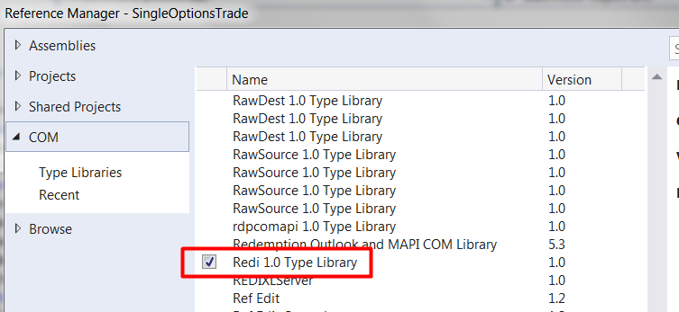

# Trading Single Options in C#
## Introduction
With REDIPlus’s powerful options capabilities, users can easily trade single and complex spread strategies globally through multiple brokers. The options trade can be sent via REDIPlus UI or REDIPlus API. This tutorial demonstrates how to trade single option via REDIPlus API with C# and Visual Studio 2017. REDIPlus and the tutorial example run on the same machine, side by side.  

Please note that this example doesn't demonstrate how to retrieve real-time price from REDIPlus API. Rather, this tutorial is focused on sending options orders.

The complete project code is available for download at [SingleOptionsTrade](https://github.com/TR-API-Samples/Example.REDI.CSharp.Examples/tree/master/SingleOptionsTrade).


## Prerequisites

* REDIPlus is installed
* REDIPlus valid credentials are used to login
* User has access to the REDI broker simulator route (for testing purposes)
* Visual Studio 2017
* REDIPlus API

Note: To install REDIPlus and REDIPlus API, please refer to [REDIPlus & API Installation Guide](https://developers.thomsonreuters.com/transactions/redi-api/quick-start).

## Implementation
**1. Create a project:**

We start by creating a new Visual Studio project:

File->New->Project-> Visual C# -> Console App (.NET Framework)

**2. Add the Redi 1.0 Type library**

REDIPlus API is a COM library. To use it, we need to create a reference to this library. In the solution explorer, right click on **References** and select **Add Reference...** . 

On the left menu, select **COM** and then check on **Redi 1.0 Type Library**. 



Click on **OK** button to add REDIPlus API to the project.

If **Redi 1.0 Type Library** doesn't appear on the list, click **Browser...** button to locate the **Redi.tlb** file. Typically, this file should be found in **%LOCALAPPDATA%\REDI Tech\Primary** folder.

After adding the **Redi 1.0 Type Library**, expand the **References** in the solution explorer. The **RediLib** will be appeared in the list.


Then, add the **using** directive to the code to allow the use of types in the RediLib namespace.

```csharp
using RediLib;
```

**3. Get expiration dates**

The expiration date is a required field for trading options. **RediLib.OPTIONORDER** can also be used to get the list of expiration dates for an option.

First, the application creates a new instance of **RediLib.OPTIONORDER** and sets an option in its **Symbol** property.

```csharp
OPTIONORDER objOrder = new OPTIONORDER();
objOrder.Symbol = "IBM";
```

Next, it calls **GetExpirationDatesCount** to get the count of option expiration dates based on the order object. The count is returned in the reference variable passed as an argument.
```csharp
object objExpirationCount = null;
objOrder.GetExpirationDatesCount(ref objExpirationCount);

```
Then, it calls **GetExpirationDateAt** for each index to get the options expiration date in REDI format from the expiration date list.
```csharp
for (int i = 0; i < (int)objExpirationCount; i++)
{
    object objExpiration = null;
    objExpiration = objOrder.GetExpirationDateAt(i);
    ...
}
```

**4. Get strike prices**

The strike price is a required field for trade options. **RediLib.OPTIONORDER** can be used to get the list of strike prices for an option.

First, the application creates a new instance of **RediLib.OPTIONORDER** and populate it with an option symbol, option type (Call or Put), and expiration date. For example:

```csharp
OPTIONORDER objOrder = new OPTIONORDER();
objOrder.Symbol = "IBM";
objOrder.type = "Call";
objOrder.Date = "Jul 27 '18";
```

Next, it calls **GetStrikesCount** to get the count of options strike prices based on the order object. The count is returned in the reference variable passed as an argument.
```csharp
object objStrikeCount = null;
objOrder.GetStrikesCount(ref objStrikeCount);
```
Then, it calls **GetStrikeAt** for each index to get the options strike price from the strike price list.
```csharp
for (int i = 0; i < (int)objStrikeCount; i++)
{
    object objStrike = null;
    objStrike = objOrder.GetStrikeAt(i);
    ...
}
```

**5. Submit a single option order**

An instance of **OPTIONORDER** can be used to submit an order. First, the application needs to create an instance of **OPTIONORDER**. Then, populate it with the following order information:

|Property Name|Description|Example|
|-------------|-----------|-------|
|Symbol|The symbol of an option|IBM|
|Quantity|Options contract size|1|
|Price|Limit Price of an order. It is used when the price type is Limit, Limit Close, or Stop Limit|10.50|
|StopPrice|Stop Price of an order. It is used when the price type is Stop, or Stop Limit|11.50|
|type|Options Type (Call or Put)|Call|
|Date|Options expiration date in REDI date format. **OPTIONORDER.GetExpirationDateAt** can be used to retrieve expiration dates, as shown in step 3|Jul 27 '18|
|Strike|The strike price of an option. **OPTIONORDER.GetStrikeAt** can be used to retrieve strike prices, as shown in step 4|185.00|
|Position|Options order position (Open or Close)|Open|
|Side|Side of an order (Buy or Sell)|Buy|
|Exchange|Broker (or Exchange) Destination. The application can use "DEM1 DMA" for a broker simulator. **OPTIONORDER.GetExchangeAt** can be used to retrieve the broker/exchange destination name from the exchange list|DEM1 DMA|
|PriceType|Order type of an order (Limit, Stop, Stop Limit, Market Close, Market, or Limit Close). **OPTIONORDER.GetPriceTypeAt** can be used to retrieve the options price type name from the price type list |Limit|
|TIF|Time In Force for an order (Day). **OPTIONORDER.GetTIFAt** can be used to retrieve the TIF (time in force) from the TIF list |Day|
|Account|The account used for this order. **OPTIONORDER.GetAccountAt** can be used to get the account name from the account list|EQUITY-TR|
|Ticket|The ticket associated in this order. The possible values are **Bypass**, **Direct**, **Stage**, **Autoticket**, and **Autocreate**. <ul><li>**Bypass** lets users trade without using tickets</li><li>**Direct** also lets users trade without using tickets</li><li>**Stage** lets a staged order created in REDI, which must be manually released in REDI before it goes to the broker</li><li>**Autoticket** trades the order attributing to the ticket, using FIFO methodology</li><li>**Autocreate** simultaneously creates a ticket and an order</li></ul>|Bypass|

For example, the below code is **Buy to Open** a contract for IBM Jul 27 '18 $185.00 Call at 10.50. Time in force is Day and the order type is Limit. The order will be sent to a broker simulator with bypass ticket.

```csharp
OPTIONORDER objOrder = new OPTIONORDER();

objOrder.Symbol = "IBM";
objOrder.PriceType = "Limit";     
objOrder.Quantity = "1";
objOrder.Price = "10.50";
objOrder.type = "Call";
objOrder.Date = "Jul 27 '18";          
objOrder.Strike = "185.00";           
objOrder.Position = "Open";         
objOrder.Side = "Buy";            
objOrder.Exchange = "DEM1 DMA";       
objOrder.TIF = "Day";
objOrder.Account = "EQUITY-TR";
objOrder.Ticket = "Bypass";
```
Then, **OPTIONORDER.Submit** is called to submit an order. 
```csharp
object ord_err = null;
bool status;
status = objOrder.Submit(ref ord_err);
if (!status)
{
    Console.WriteLine($"{(string)ord_err}");
}
```
This method returns **True** if order submission was successful. Otherwise it will return **False**. If it returns **False**, the failure reason will be populated in the reference variable passed as a string argument. 

## Example
The simple application called **SingleOptionsTrade** is developed to demonstrate how to send a single options trade.

**1. Parsing Command Line Arguments**

The application depends on the **CommandLineParser** package to manipulate command line arguments. It supports the following parameters:

```
  -s, --symbol        Required. The symbol of an option

  -q, --quantity      (Default: 1) Options contract size

  -l, --limitprice    Limit Price of an order (Required by "Limit", "Stop Limit", "Limit
                      Close")

  -t, --stopprice     Stop Price of an order (Required by "Stop", "Stop Limit")

  -y, --type          (Default: Call) Options Type (Call or Put)

  -x, --expdate       Options expiration date in REDI date format (e.g. "Oct 05 '18")

  -k, --strike        The strike price of an option

  -o, --position      (Default: Open) Options order position (Open or Close)

  -d, --side          (Default: Buy) Side of an order (Buy or Sell)

  -e, --exchange      (Default: DEM1 DMA) Broker (or Exchange) Destination

  -f, --tif           (Default: Day) Time In Force for an order

  -p, --pricetype     (Default: Limit) Order type of an order (Limit, Stop, Stop Limit,
                      Market Close, Market, or Limit Close)

  -a, --account       The account used for this order

  -c, --ticket        (Default: Bypass) The ticket associated in this order

  --help              Display this help screen

  --version           Display version information
```

The symbol (-s, --symbol) is a required argument. However, price (-l, --limitprice) or stop price (-t, --stopprice) can be required depending on the value of price type (-r, --pricetype). For example, if the price type is Limit, the price (-l, --limitprice) is required. 

**2. Get the Expiration Date**

If the date (-d, --date) is not specified, the application will use the first available expiration date. It uses a function called **GetExpirationDate** which accepts an option symbol and returns the first expiration date for that option. If there is no expiration data for that option, it will return null.

The function calls **GetExpirationDatesCount** to get the count of option expiration dates based on the order object and then calls **GetExpirationDateAt** with the first index (0) to get and return the first options expiration date in REDI format from the expiration date list.


```csharp
private string GetExpirationDate(string symbol)
{
    OPTIONORDER objOrder = new OPTIONORDER();
    objOrder.Symbol = symbol;

    object objExpirationCount = null;
    objOrder.GetExpirationDatesCount(ref objExpirationCount);
    if (objExpirationCount == null || (int)objExpirationCount == 0)
    {
        return null;
    }
    else
    {
        return (string)(objOrder.GetExpirationDateAt(0));
    }
}
```

**3. Get Strike Price**

If the strike price (-k, --strike) is not specified, the application will use the first available strike price. It uses a function called **GetStrikePrice** which accepts an option symbol, option type, and expiration date and returns the first price for that option. If there is no strike price for that option, it will return null.

The function calls **GetStrikesCount** to get the count of options strike prices based on the order object, and then calls **GetStrikeAt** with the first index (0) to get and return the first options strike price from the strike price list.

```csharp
private string GetStrikePrice(string symbol, string type, string expirationDate)
{
    OPTIONORDER objOrder = new OPTIONORDER();
    objOrder.Symbol = symbol;
    objOrder.type = type;
    objOrder.Date = expirationDate;

    object objStrikeCount = null;
    objOrder.GetStrikesCount(ref objStrikeCount);

    if (objStrikeCount == null || (int)objStrikeCount == 0)
    {
        return null;
    }
    else
    {              
        return (string)objOrder.GetStrikeAt(0);
    }
}

```

**4. Get Account**

If the account (-a, --account) is not specified, the application will use the first available account. It uses a function called **GetAccount** which returns the first available account. If there is no available account, it will return null.

The function calls **GetAccountCount** to get the count of account based on the order object, and then calls **GetAccountAt** with the first index (0) to get and return the first account from the account list.

```csharp
private string GetAccount()
{
    OPTIONORDER objOrder = new OPTIONORDER();
    object objAccountCount = null;
    objOrder.GetAccountCount(ref objAccountCount);
    if(objAccountCount == null || (int)objAccountCount == 0)
    {
        return null;
    }
    else
    {              
        return (string)objOrder.GetAccountAt(0);
    }            
}

```
**5. Submit an Order**

After the values have been verified, the application submits an order. 
```csharp
private void SendOrder()
{
    OPTIONORDER objOrder = new OPTIONORDER();

    PrintOrder();

    objOrder.Symbol = options.Symbol;
    objOrder.PriceType = options.PriceType;
    objOrder.Quantity = options.Quantity.ToString();
    switch (options.PriceType)
    {
        case "Limit":
        case "Limit Close":
            objOrder.Price = options.Price.ToString();
            break;
        case "Stop":
            objOrder.StopPrice = options.StopPrice.ToString();
            break;
        case "Stop Limit":
            objOrder.Price = options.Price.ToString();
            objOrder.StopPrice = options.StopPrice.ToString();
            break;

    }         
    objOrder.type = options.Type;
    objOrder.Date = options.Date;          
    objOrder.Strike = options.Strike;           
    objOrder.Position = options.Position;         
    objOrder.Side = options.Side;            
    objOrder.Exchange = options.Exchange;            
    objOrder.TIF = options.TIF;
    objOrder.Account = options.Account;
    objOrder.Ticket = options.Ticket;
   
    object ord_err = null;
    bool status;
    status = objOrder.Submit(ref ord_err);
    if (!status)
    {
        Console.WriteLine($"Error: {(string)ord_err}");
    }
    else
    {
        Console.WriteLine("Order has been submitted properly");
    }
}

```
It creates a new instance of **OPTIONORDER** and populates its value. The usage of **Price** and **StopPrice** fields depends on the value of **PriceType** (Order Type). 

* If the order type is "**Limit**" or "**Limit Close**", only the limit price (**Price**) must be used
* If the order type is "**Stop Limit**", both the limit price (**Price**) and stop price (**StopPrice**) must be used
* If the order type is "**Stop**", only the stop price (**StopPrice**) must be used
* If the order type is "**Market**" or "**Market Close**", the limit price (**Price**) and stop price (**StopPrice**) aren't used

Then, it calls **OPTIONORDER.Submit** to submit the order. If the submit returns false which indicates failure, the error will be printed to the console.  

## Test and Run

**1. Buy to Open a contract of IBM Nov '18 140 call at 15.20**
```
OptionsTrade.exe -s IBM -x "Nov '18" -k 140 -l 15.20
```
The command runs with the symbol (-s), expiration data (-x), strike price (-k) and limit price (-l) options. Therefore, it uses the account retrieved from the REDIPlus API. For other options, the default values are used.

```
Send an order with the following options:
Symbol: IBM
PriceType: Limit
Limit Price: 15.20
Quantity: 1
Type: Call
Date: Nov '18
Strike: 140
Position: Open
Exchange: DEM1 DMA
TIF: Day
Account: EQUITY-TR
Ticket: Bypass
==============================
Order has been submitted properly
```
The order can be verified from the Message Monitor.


**2. Buy to Open a contract of IBM Nov '18 145 put with the Market price type**
```
OptionsTrade.exe -s IBM -x "Nov '18" -k 145 -y Put -p Market
```
The command runs with the symbol (-s), expiration date (-x), strike price (-k), type (-y), and price type (-p) options. Therefore, it uses the account retrieved from the REDIPlus API. For other options, the default values are used.

```
Send an order with the following options:
Symbol: IBM
PriceType: Market
Quantity: 1
Type: Put
Date: Nov '18
Strike: 145
Position: Open
Exchange: DEM1 DMA
TIF: Day
Account: EQUITY-TR
Ticket: Bypass
==============================
Order has been submitted properly
```
The order can be verified from the Message Monitor.


**3. Buy to Open two contract of IBM Nov '18 140 call at 15.20**
```
OptionsTrade.exe -s IBM -x "Nov '18" -k 140 -l 15.20 -q 2
```
The command runs with the symbol (-s), expiration date (-x), strike price (-k), limit price (-l), and quantity (-q) options. Therefore, it uses account retrieved from the REDIPlus API. For other options, the default values are used.

```
Send an order with the following options:
Symbol: IBM
PriceType: Limit
Limit Price: 15.20
Quantity: 2
Type: Call
Date: Nov '18
Strike: 140
Position: Open
Exchange: DEM1 DMA
TIF: Day
Account: EQUITY-TR
Ticket: Bypass
==============================
Order has been submitted properly
```
The order can be verified from the Message Monitor.


If it returns an **Invalid Date** error, the format of expiration date may be incorrect or the expiration date is invalid. To retrieve all valid expiration dates, the application can call the **GetExpirationDatesCount** and **GetExpirationDateAt** functions.

## Summary

The options trade can be sent via REDIPlus UI or REDIPlus API. With REDIPlus API, **RediLib.OPTIONORDER** class is used to populate and submit an order. This class can also be used to get the list of accounts, exchanges, expiration dates, strike prices, price types, and time in force.

The usage is simple. The application creates a new instance of **RediLib.OPTIONORDER** class, populates its values, and then call submit to send an order.

## References
* [REDI API SPECIFICATION](https://developers.thomsonreuters.com/transactions/redi-api/docs?content=25822&type=documentation_item)
